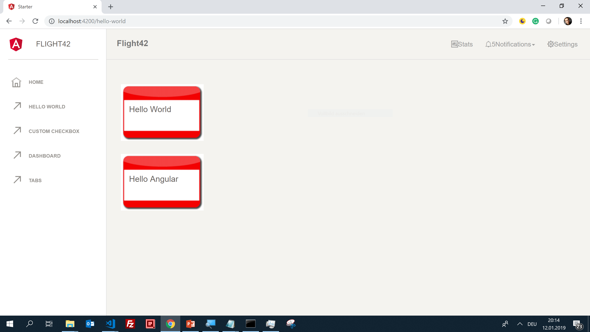
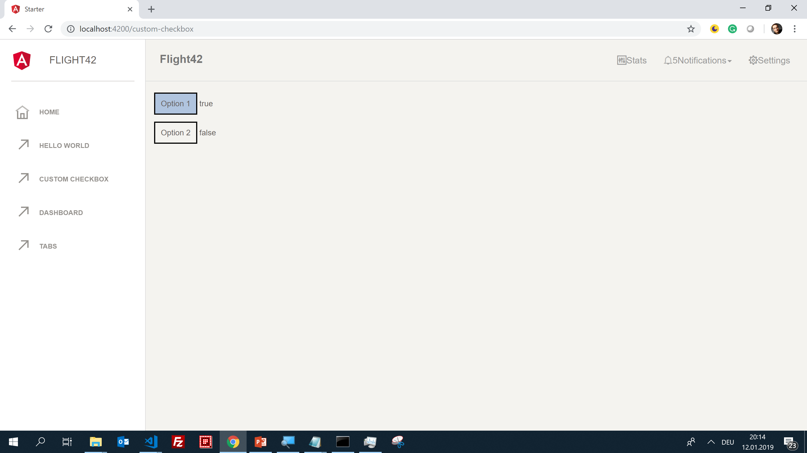
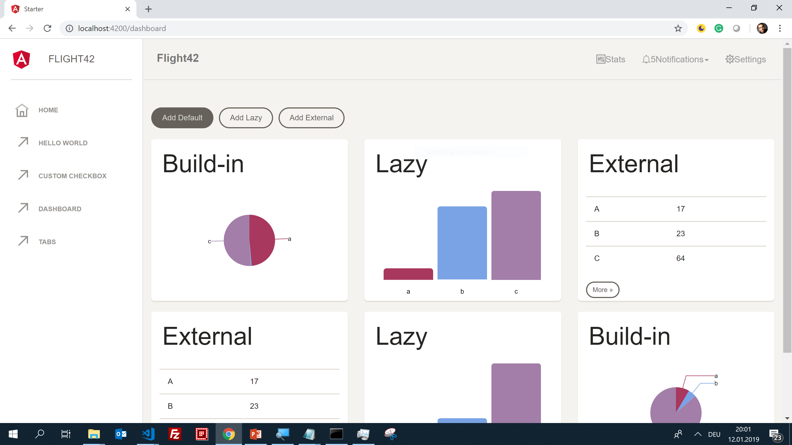
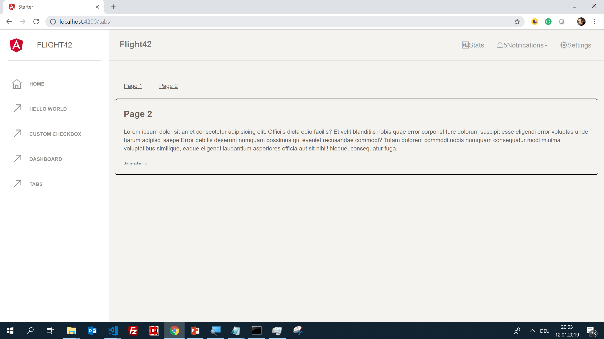
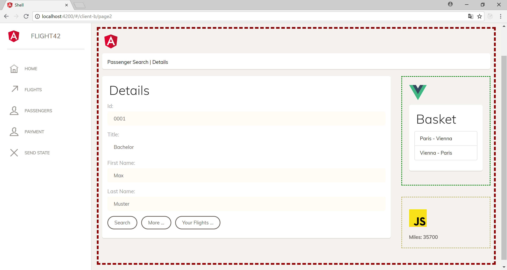

# Angular + Web Components Samples

## Using existing Web Components with Angular

## Two-Way-Data-Binding with existing Web Components

## Angular Elements 

## Advanced Build Options

- Sharing dependencies by using externals (see Branch ``build-externals``)
- Differential Serving (see Branch ``build-modern``)

## Content Projection and Slot API

## Micro Apps

Code see: https://github.com/manfredsteyer/Angular_MicroApps_Different_Technologies

## More: Workshops & Blog
See: https://www.softwarearchitekt.at